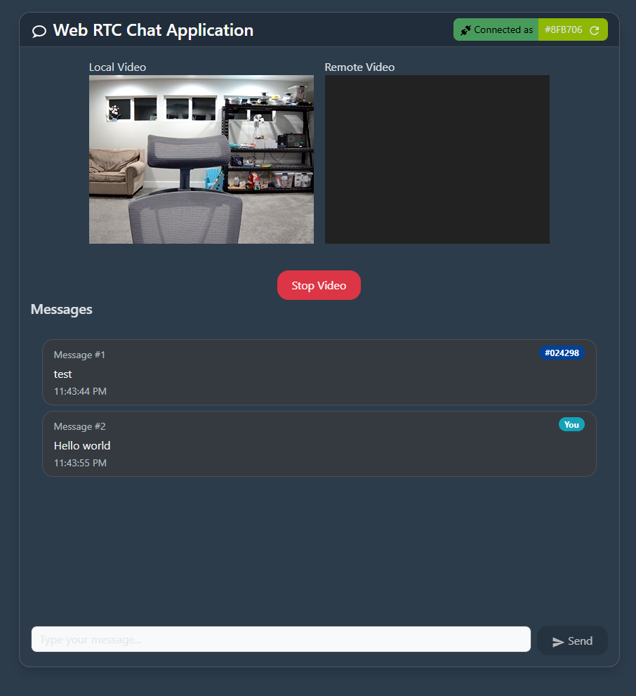

<p align="center">
  
</p>

# WebRTC Video Chat & Messaging App

A modern, full-stack TypeScript application for real-time video chat and messaging using WebRTC and WebSockets. Built with Vite, React, Bootstrap, and Express.

## Features

- **Frontend**: React + TypeScript + Vite with hot reload
- **Styling**: Bootstrap 5.3.2 + Less preprocessor for custom styles
- **Backend**: Express server with WebSocket support
- **Real-time Communication**: WebSocket-based messaging
- **Development**: Hot reload for both client and server

## Project Structure

```
web-rtc/
├── client/                 # Vite + React + TypeScript frontend
│   ├── src/
│   │   ├── App.tsx        # Main React component
│   │   ├── main.tsx       # Application entry point
│   │   └── ...
│   ├── package.json
│   └── vite.config.ts
├── server/                 # Express + WebSocket server
│   ├── src/
│   │   └── index.ts       # Server entry point
│   ├── package.json
│   └── tsconfig.json
└── package.json           # Root package.json for running both
```

## Getting Started

### Prerequisites

- Node.js (v18 or higher)
- npm or yarn package manager

### Installation

1. Clone the repository:
```bash
git clone <repository-url>
cd web-rtc
```

2. Install dependencies for all projects:
```bash
npm run install:all
```

### Development

To run both client and server in development mode with hot reload:

```bash
npm run dev
```

This will start:
- Client development server on `http://localhost:3000`
- WebSocket server on `http://localhost:8080`

### Individual Commands

**Client only:**
```bash
npm run dev:client
```

**Server only:**
```bash
npm run dev:server
```

**Build for production:**
```bash
npm run build
```

## Usage

1. Start the development servers using `npm run dev`
2. Open your browser to `http://localhost:3000`
3. You should see a chat interface that connects to the WebSocket server
4. Open multiple browser tabs to test real-time messaging between clients

## Technology Stack

### Frontend
- **React 18** - UI library
- **TypeScript** - Type safety
- **Vite** - Build tool with hot reload
- **Bootstrap 5.3.2** - CSS framework
- **Sass** - CSS preprocessor for enhanced styling
- **ESLint** - Code linting

### Backend
- **Express** - Web framework
- **WebSocket (ws)** - Real-time communication
- **TypeScript** - Type safety
- **CORS** - Cross-origin resource sharing
- **Nodemon** - Development server auto-restart

## WebSocket API

The server provides the following WebSocket message types:

### Client to Server
```json
{
  "message": "Your message here"
}
```

### Server to Client
```json
{
  "type": "welcome",
  "message": "Connected to WebSocket server!"
}
```

```json
{
  "type": "broadcast", 
  "message": "User message",
  "timestamp": "2025-07-26T12:00:00.000Z"
}
```

```json
{
  "type": "error",
  "message": "Error description"
}
```

## Development Notes

- The client is configured to connect to `ws://localhost:8080` for WebSocket communication
- Both client and server support hot reload during development
- TypeScript is configured with strict mode for better type safety
- Bootstrap is included globally in the client application

## License

MIT